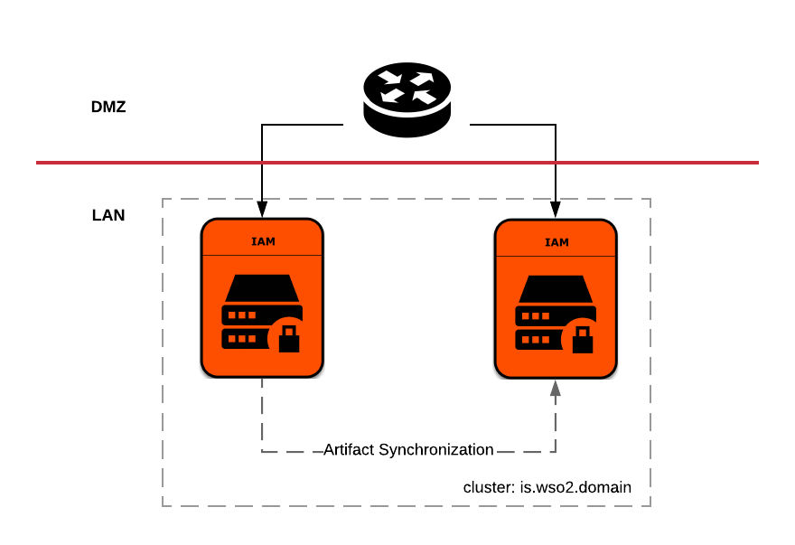

# WSO2 Identity Server Pattern-1

WSO2 Identity Server Deployment Pattern 1 runs two Identity Server instances fronted with a load balancer. Identity 
Server nodes are clustered and a shared file system or a synchronization mechanism like rsync can be used to synchronize 
runtime artifacts.


  
The hiera YAML in this directory can be used to setup each WSO2 Identity Server node participating in the 
cluster.

Follow the given steps below, to configure hiera YAML with respect to the deployment.

1. Update hostname

    Update ```wso2::hostname``` and ```wso2::mgt_hostname``` in the [default.yaml](default.yaml) file with the DNS name 
    of the load balancer. If the environment does not have a load balancer, then make sure to add the hostname mapping to 
    /etc/hosts file. 
    e.g:
    ```
    wso2::hostname: is.wso2.com
    wso2::mgt_hostname: is.wso2.com
    ```
2. Configure JDBC driver jar file name

    Configure the JDBC driver file name under ```wso2::file_list``` or in common.yaml. For MYSQL there is an 
    entry in common.yaml as ```wso2::datasources::mysql::connector_jar``` which is then referred by the [default.yaml]
    (default.yaml) file here.
    e.g:
     ```
     wso2::file_list:
       - "repository/components/lib/%{hiera('wso2::datasources::mysql::connector_jar')}"
    ```
3. Configure a clustering scheme

    Configure a clustering scheme under ```wso2::clustering```. By default, WKA related configurations are added. 
    Update the member list under WKA scheme in [default.yaml](default.yaml) file with the ip addresses of the members
     participating in the cluster.
    e.g:
    ```
    membership_scheme: wka
      wka:
        members:
          -
            hostname: 192.168.48.194
            port: 4000
          -
            hostname: 192.168.48.195
            port: 4000
    ```
4. Configure datasources

    Update the data sources to point to an external RDBMS server. There are three datasources defined.
    For each datasource you will have to configure the connection URL against ```url```, connection username against 
    ```username``` and password against ```password``` property keys. Datasources defined in this hiera file are below.
    * Datasource in repository/conf/master-datasources.xml file:
    
    A single datasource can be configured to be used with used for registry, user management and identity
    e.g:
    ```
    wso2::master_datasources:
      identity_ds:
        name: WSO2_IDENTITY_DS
        description: The datasource used for registry, user management and identity
        driver_class_name: "%{hiera('wso2::datasources::mysql::driver_class_name')}"
        url: jdbc:mysql://192.168.100.1:3306/WSO2_IDENTITY_DB?autoReconnect=true&amp;useSSL=false
        username: "%{hiera('wso2::datasources::mysql::username')}"
        password: "%{hiera('wso2::datasources::mysql::password')}"
        jndi_config: jdbc/WSO2IdentityDS
        max_active: "%{hiera('wso2::datasources::common::max_active')}"
        max_wait: "%{hiera('wso2::datasources::common::max_wait')}"
        test_on_borrow: "%{hiera('wso2::datasources::common::test_on_borrow')}"
        default_auto_commit: "%{hiera('wso2::datasources::common::default_auto_commit')}"
        validation_query: "%{hiera('wso2::datasources::mysql::validation_query')}"
        validation_interval: "%{hiera('wso2::datasources::common::validation_interval')}"
    ```
    * BPS datasource in repository/conf/datasources/bps-datasources.xml file:
    
    Datasource used to manage the embedded BPS engine related data.
    e.g:
    ```
    wso2::bps_datasources:
      bps_ds:
        name: WSO2_BPS_DS
        description: The datasource used for bps
        driver_class_name: "%{hiera('wso2::datasources::mysql::driver_class_name')}"
        url: jdbc:mysql://192.168.100.1:3306/WSO2_IDENTITY_DB?autoReconnect=true
        username: "%{hiera('wso2::datasources::mysql::username')}"
        password: "%{hiera('wso2::datasources::mysql::password')}"
        jndi_config: bpsds
        max_active: "%{hiera('wso2::datasources::common::max_active')}"
        max_idle: "%{hiera('wso2::datasources::common::max_idle')}"
        max_wait: "%{hiera('wso2::datasources::common::max_wait')}"
        test_on_borrow: "%{hiera('wso2::datasources::common::test_on_borrow')}"
        use_datasource_factory: "%{hiera('wso2::datasources::common::use_datasource_factory')}"
        default_auto_commit: "%{hiera('wso2::datasources::common::default_auto_commit')}"
        validation_query: "%{hiera('wso2::datasources::mysql::validation_query')}"
        validation_interval: "%{hiera('wso2::datasources::common::validation_interval')}"
    ```
5. Configure user store.

   Configure a JDBC user store, LDAP or an Active Directory, with connection URL, connection username and password.
   e.g:
   ```
   wso2::user_store:
     user_store_type: jdbc
     user_store_properties:
       jdbc:
         driver_class_name: "%{hiera('wso2::datasources::mysql::driver_class_name')}"
         url: jdbc:mysql://192.168.100.1:3306/WSO2_USER_DB?autoReconnect=true&amp;useSSL=false
         username: "%{hiera('wso2::datasources::mysql::username')}"
         password: "%{hiera('wso2::datasources::mysql::password')}"
   ```
 6. In the puppet agent set below factor variables as explained in [wiki](https://github
 .com/wso2/puppet-base/wiki/Use-WSO2-Puppet-Modules-in-puppet-master-agent-Environment#task-3---set-facter-variables
 -and-perform-a-puppet-agent-run), and run puppet agent
    ```
    product_name=wso2is
    product_version=5.4.0
    product_profile=default
    environment=production
    use_hieradata=true
    platform=default
    pattern=pattern-1
    ```
