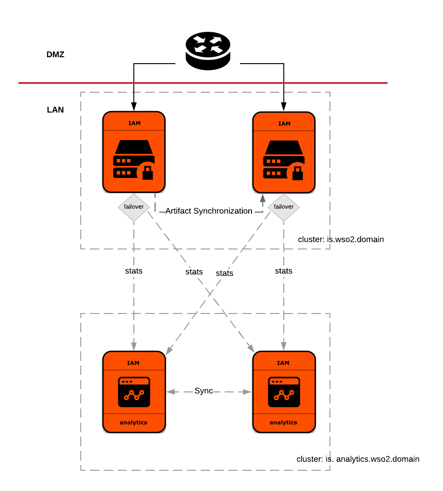

# WSO2 Identity Analytics Server Pattern-1

[WSO2 Identity Server Deployment Pattern 2](https://docs.wso2.com/display/IS540/Deployment+Patterns#DeploymentPatterns-Pattern2-HAclustereddeploymentofWSO2IdentityServerwithWSO2IdentityAnalytics) 
runs two Identity Server instances fronted with a load balancer with WSO2 
Identity Analytics [minimum high availability deployment](https://docs.wso2.com/display/IS540/Setting+Up+Deployment+Pattern+2#SettingUpDeploymentPattern2-MinimumHighAvailabilityDeploymentforWSO2ISAnalytics). 


  
The hiera YAML in this directory can be used to setup each WSO2 Identity Analytics Server node participating in the 
above deployment.

Follow the given steps below, to configure hiera YAML with respect to the deployment.

1. Update hostname

    Update ```wso2::hostname``` and ```wso2::mgt_hostname``` in the [default.yaml](default.yaml) file with the DNS name 
    of the load balancer. If the environment does not have a load balancer, then make sure to add the hostname mapping to 
    /etc/hosts file. 
    e.g:
    ```
    wso2::hostname: is.analytics.dev.wso2.org
    wso2::mgt_hostname: is.analytics.dev.wso2.org
    ```
2. Configure JDBC driver jar file name

    Configure the JDBC driver file name under ```wso2::file_list``` or in common.yaml. For MYSQL there is an 
    entry in common.yaml as ```wso2::datasources::mysql::connector_jar``` which is then referred by the [default.yaml]
    (default.yaml) file here.
    
    e.g:
     ```
     wso2::file_list:
       - "repository/components/lib/%{hiera('wso2::datasources::mysql::connector_jar')}"
    ```
3. Configure datasources

    Update the data sources to point to an external RDBMS server. 
    
    You can configure the database server engine, host name and port under below hiera configurations.
    These properties are then used in configuring connection URLs in hiera.
    ```
    wso2::rdbms::engine: mysql
    wso2::rdbms::hostname: mysql.sever.com
    wso2::rdbms::port: 3306
    ```

    For each datasource you will have to configure the connection URL against ```url``` adding the database name and 
    other connection URL query parameters, connection username against  ```username``` and password against 
    ```password``` property keys. Datasources defined in this hiera file are below.
    * Datasource in repository/conf/master-datasources.xml file:
    
    A single datasource can be configured for registry and user management
    
    e.g:
    ```
    wso2::master_datasources:
      analytics_ds:
          name: WSO2_ANALYTICS_DS
          description: The datasource used for registry and user management
          driver_class_name: "%{hiera('wso2::datasources::mysql::driver_class_name')}"
          url: jdbc:mysql://192.168.100.1:3306/WSO2_ANALYTICS_DB?autoReconnect=true&amp;useSSL=false
          username: "%{hiera('wso2::datasources::mysql::username')}"
          password: "%{hiera('wso2::datasources::mysql::password')}"
          jndi_config: jdbc/WSO2AnalyticsDS
          max_active: "%{hiera('wso2::datasources::common::max_active')}"
          max_wait: "%{hiera('wso2::datasources::common::max_wait')}"
          test_on_borrow: "%{hiera('wso2::datasources::common::test_on_borrow')}"
          default_auto_commit: "%{hiera('wso2::datasources::common::default_auto_commit')}"
          validation_query: "%{hiera('wso2::datasources::mysql::validation_query')}"
          validation_interval: "%{hiera('wso2::datasources::common::validation_interval')}"
    ```
    * Analytics event store datasource in repository/conf/datasources/analytics-datasources.xml file:
    
    Datasource used for analytics event store. It is recommended to configure a separate database that is read write 
    optimized as the analytics event store. For more details refer
     [minimum HA deployment guideline](https://docs.wso2.com/display/IS540/Setting+Up+Deployment+Pattern+2#SettingUpDeploymentPattern2-MinimumHighAvailabilityDeploymentforWSO2ISAnalytics) for WSO2 Identity Analytics. 
    
    e.g:
    ```
    wso2::analytics_datasources:
      analytics_event_store_ds:
          name: WSO2_ANALYTICS_EVENT_STORE_DS
          description: The datasource used for analytics record store
          driver_class_name: "%{hiera('wso2::datasources::mysql::driver_class_name')}"
          url: "jdbc:%{hiera('wso2::rdbms::engine')}://%{hiera('wso2::rdbms::hostname')}:%{hiera('wso2::rdbms::port')}/WSO2_ANALYTICS_EVENT_STORE_DB?autoReconnect=true&amp;useSSL=false"
          username: "%{hiera('wso2::datasources::mysql::username')}"
          password: "%{hiera('wso2::datasources::mysql::password')}"
          max_active: "%{hiera('wso2::datasources::common::max_active')}"
          max_wait: "%{hiera('wso2::datasources::common::max_wait')}"
          test_on_borrow: "%{hiera('wso2::datasources::common::test_on_borrow')}"
          default_auto_commit: "%{hiera('wso2::datasources::common::default_auto_commit')}"
          validation_query: "%{hiera('wso2::datasources::mysql::validation_query')}"
          validation_interval: "%{hiera('wso2::datasources::common::validation_interval')}"
          default_auto_commit: false
          initial_size: 0
          test_while_idle: true
          min_evictable_idle_time_millis: 4000
        
     # Analytics event store datasource configuration in repository/conf/analytics/analytics-config.xml
     wso2::analytics_event_store_datasource: analytics_event_store_ds
    ```
      * Analytics processed data store datasource in repository/conf/datasources/analytics-datasources.xml file:
        
        Datasource used for analytics processed data store. It is recommended to configure a separate database that is 
        write optimized as the analytics event store. For more details refer
         [minimum HA deployment guideline](https://docs.wso2.com/display/IS540/Setting+Up+Deployment+Pattern+2#SettingUpDeploymentPattern2-MinimumHighAvailabilityDeploymentforWSO2ISAnalytics) for WSO2 Identity Analytics. 
        
        e.g:
        ```
        wso2::analytics_datasources:
          analytics_processed_data_store_ds:
              name: WSO2_ANALYTICS_PROCESSED_DATA_STORE_DS
              description: The datasource used for analytics record store
              driver_class_name: "%{hiera('wso2::datasources::mysql::driver_class_name')}"
              url: "jdbc:%{hiera('wso2::rdbms::engine')}://%{hiera('wso2::rdbms::hostname')}:%{hiera('wso2::rdbms::port')}/WSO2_ANALYTICS_PROCESSED_DATA_STORE_DB?autoReconnect=true&amp;useSSL=false"
              username: "%{hiera('wso2::datasources::mysql::username')}"
              password: "%{hiera('wso2::datasources::mysql::password')}"
              max_active: "%{hiera('wso2::datasources::common::max_active')}"
              max_wait: "%{hiera('wso2::datasources::common::max_wait')}"
              test_on_borrow: "%{hiera('wso2::datasources::common::test_on_borrow')}"
              default_auto_commit: "%{hiera('wso2::datasources::common::default_auto_commit')}"
              validation_query: "%{hiera('wso2::datasources::mysql::validation_query')}"
              validation_interval: "%{hiera('wso2::datasources::common::validation_interval')}"
              default_auto_commit: false
              initial_size: 0
              test_while_idle: true
              min_evictable_idle_time_millis: 4000
            
         # Analytics processed data store datasource configuration in repository/conf/analytics/analytics-config.xml
         wso2::analytics_processed_data_store_datasource: analytics_processed_data_store_ds
        ```
4. Configure a clustering scheme for minimum HA deployment
 
    Configure a clustering scheme under ```wso2::clustering```. By default, WKA related configurations are added. 
    Update the member list under WKA scheme in [default.yaml](default.yaml) file with the ip addresses of the members
    participating in the cluster.
    
    e.g:
    ```
    wso2::clustering:
    enabled: true
    domain: is.analytics.wso2.domain
    local_member_host: "%{::ipaddress}"
    local_member_port: 4000
    sub_domain: mgt
    
    membership_scheme: wka
    wka:
     members:
       -
         # local member host
         hostname: "%{::ipaddress}"
         port: 4000
       -
         # well known member host
         hostname: 192.168.48.195
         port: 4000
    ```

5. In the puppet agent set below factor variables as explained in
 [wiki](https://github.com/wso2/puppet-base/wiki/Use-WSO2-Puppet-Modules-in-puppet-master-agent-Environment#task-3---set-facter-variables-and-perform-a-puppet-agent-run), 
and run puppet agent
    ```
    product_name=wso2is_analytics
    product_version=5.4.0
    product_profile=default
    environment=production
    use_hieradata=true
    platform=default
    pattern=pattern-1
    ```
